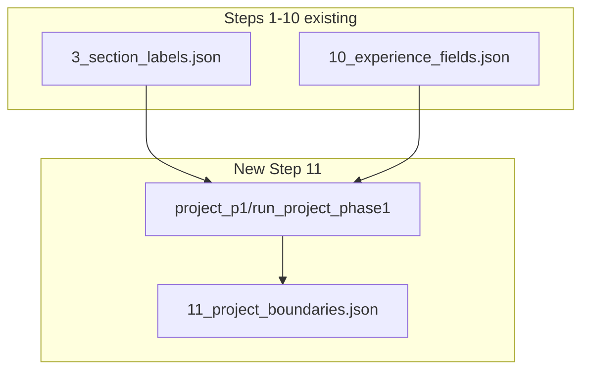

# Lock Step 10 + Project Step 11 (Boundaries)

## Part A — Lock `10_experience_fields.json`

Experience steps 8–9 are already marked LOCKED in [`training-engine/inference_v2/README.md`](training-engine/inference_v2/README.md). Step 10 should receive the same treatment now that Karan regression passes (96.3% macro F1 proxy; date blocks correct).

### Documentation updates

| File                                                                                                         | Change                                                                                                    |
| ------------------------------------------------------------------------------------------------------------ | --------------------------------------------------------------------------------------------------------- |
| [`README.md`](training-engine/inference_v2/README.md)                                                        | Step 10 row: `IN PROGRESS` → `LOCKED`; remove "active development" note                                   |
| [`EXPERIENCE_PIPELINE_GUIDE.md`](training-engine/inference_v2/EXPERIENCE_PIPELINE_GUIDE.md)                  | Add § "Step 10 locked baseline" with Karan checklist results and explicit "do not change without re-open" |
| [`training_pipeline/experience/EXPERIENCE_PIPELINE.md`](training_pipeline/experience/EXPERIENCE_PIPELINE.md) | Align inference step 10 status if it references inference-v2                                              |

### Lock contract (mirror step 8 pattern)

Document in README + guide:

- **Artifact:** `10_experience_fields.json`
- **Module:** `experience_p3/` only
- **Regression resume:** Karan (`Karan_9e7bb9` or latest slug)
- **Must hold:** 3 jobs (L14/L26/L33); DATE blocks `March 2023 Present )`, `( July'22 - March' 2023 )`, `( Jan'22 - July'22 )`; no date+project line merges
- **Known scoring quirk:** `Pvt. Ltd. (` gt=DATE vs pred=COMP — Mongo `(March` vs PDF `(`+`March` tokenization (documented in guide §5.8); not a model bug

No new `step10FieldGt.ts` needed — step 10 GT already uses raw Mongo `bioLabel` per block (see README § Step 9 & 10).

---

## Part B — Project Step 11: Entry Boundaries (`project_p1/`)

User confirmed scope: **boundaries only** (inference divide stage), matching experience step 8 pattern.

### Architecture (isolated, mirrors experience)



| Inference | Artifact                     | Module        | Training source                  | Labels                              |
| --------- | ---------------------------- | ------------- | -------------------------------- | ----------------------------------- |
| **11**    | `11_project_boundaries.json` | `project_p1/` | `project/phase2_section_divider` | `O`, `B-PROJ_START`, `I-PROJ_START` |

**Naming:** `project_p1` = first project inference module (like `experience_p1`), **not** training `phase1_token_segmentation` (that becomes step 12 later).

### New module layout

Create [`training-engine/inference_v2/project_p1/`](training-engine/inference_v2/project_p1/) (~9 files, each under 250 lines per CLAUDE.md):

| File                      | Responsibility                                                                                                                                                            |
| ------------------------- | ------------------------------------------------------------------------------------------------------------------------------------------------------------------------- |
| `__init__.py`             | `run_project_phase1(tokens, resume_id)` — public entry                                                                                                                    |
| `config.py`               | `MODEL_NAME`, `SPATIAL_DIM=16`, `NUM_LABELS=3`, checkpoint path                                                                                                           |
| `model.py`                | `build_segmenter()` — copy pattern from [`experience_p1/model.py`](training-engine/inference_v2/experience_p1/model.py)                                                   |
| `boundary_postprocess.py` | Port logic from [`project_boundary_postprocess.py`](training_pipeline/project/phase2_section_divider/project_boundary_postprocess.py)                                     |
| `boundary_line_rules.py`  | Port from training (pure rules, no cross-import from training at runtime)                                                                                                 |
| `line_utils.py`           | Port `assign_line_level_token_predictions`, `collapse_boundary_to_line_anchor`                                                                                            |
| `style_heuristic.py`      | Port from [`project_style_heuristic.py`](training_pipeline/project/phase2_section_divider/project_style_heuristic.py)                                                     |
| `heads_loader.py`         | Load `projectEntryHeads` via existing [`overlay_mongo_labels.load_mongo_entry_heads`](training-engine/inference_v2/overlay_mongo_labels.py)                               |
| `span_expand.py`          | Expand `B-PROJ_START` head lines to `I-PROJ_START` spans (mirror [`experience_p1/entry_span_expand.py`](training-engine/inference_v2/experience_p1/entry_span_expand.py)) |

**Critical isolation rules (from experience debugging):**

- Do **not** import `experience_p2/gap_heuristic.py` (label id collision risk)
- Do **not** put project logic in `experience_p*` files
- Overlay Mongo field labels to `_fieldBioLabel` only; write boundary labels to `bioLabel` on PROJECT tokens
- Filter: `section == "PROJECT"` (also accept `PROJECTS` if present in tokens, same as [`entities.py`](training-engine/inference_v2/entities.py))

### Model checkpoint

- Source: [`training_pipeline/project/phase2_section_divider/saved_models/minilm/best_model.pt`](training_pipeline/project/phase2_section_divider/saved_models/minilm/best_model.pt)
- Copy or symlink into `project_p1/best_model.pt` (same pattern as experience — checkpoint lives beside inference module)
- Backbone: `all-MiniLM-L6-v2`, spatial dim **16**, 3 boundary labels

### Inference pipeline (`run_project_phase1`)

Mirror [`experience_p1/__init__.py`](training-engine/inference_v2/experience_p1/__init__.py) flow:

```
1. Filter PROJECT tokens (exclude B-HEADING/I-HEADING)
2. overlay_mongo_field_labels (hints for postprocess)
3. PyTorch model predict_tokens (windowed, spatial 16-D)
4. Stamp tempBoundaryLabel from projectEntryHeads
5. apply_boundary_postprocess (training parity)
6. apply_style_heuristic
7. expand_proj_start_spans
8. Write bioLabel on tokens + artifact JSON
```

Post-process order must match training eval in [`PROJECT_PHASE2.md`](training_pipeline/project/phase2_section_divider/PROJECT_PHASE2.md).

### Artifact schema (`11_project_boundaries.json`)

Match experience boundary artifact shape:

```json
{
  "stage": "project_phase1",
  "title": "Project Entry Boundaries",
  "section": "PROJECT",
  "resumeId": "...",
  "trainingPipeline": "project/phase2_section_divider",
  "labelField": "bioLabel",
  "tokenCount": N,
  "nonOCount": N,
  "sampleLabels": ["O", "B-PROJ_START", "I-PROJ_START"],
  "tokens": [{ "page", "lineIndex", "tokenIndex", "token", "prediction", "x0", "y0", ... }]
}
```

### Pipeline wiring

| File                                                      | Change                                                                       |
| --------------------------------------------------------- | ---------------------------------------------------------------------------- |
| [`config.py`](training-engine/inference_v2/config.py)     | Add `("project_phase1", "11_project_boundaries.json")` before finalize       |
| [`pipeline.py`](training-engine/inference_v2/pipeline.py) | After step 10, call `run_project_phase1`, write artifact                     |
| [`routes.py`](training-engine/inference_v2/routes.py)     | Add `POST /runs/{slug}/rerun/project_p1` (replay steps 1–3 + run project_p1) |

Step 11 does **not** mutate experience `bioLabel` values — only PROJECT-section tokens.

### UI (inference-v2)

| File                                                                                     | Change                                                                                                                                               |
| ---------------------------------------------------------------------------------------- | ---------------------------------------------------------------------------------------------------------------------------------------------------- |
| **New** `app/app/inference-v2/lib/step11BoundaryGt.ts`                                   | LOCKED GT mapper: entity `bioLabel` → `B-PROJ_START`/`I-PROJ_START`/`O` (mirror [`step8BoundaryGt.ts`](app/app/inference-v2/lib/step8BoundaryGt.ts)) |
| [`ArtifactJsonLoader.tsx`](app/app/inference-v2/components/ArtifactJsonLoader.tsx)       | Register `11_project_boundaries.json`; token table with GT column via `step11GroundTruthLabel`                                                       |
| [`parseTrainingReport.ts`](app/app/inference-v2/lib/parseTrainingReport.ts)              | Already has `project/phase2_section_divider` — wire boundary report comparison if not already shown                                                  |
| [`PipelineArtifactsList.tsx`](app/app/inference-v2/components/PipelineArtifactsList.tsx) | Show step 11 in artifact list                                                                                                                        |

GT for step 11 token accuracy: entity labels with `B-PROJECT_NAME` (and other project `B-*`) → `B-PROJ_START`; `I-*` → `I-PROJ_START`. Entry-line FBA (for a future step 12 divider UI) uses `projectEntryHeads` only — same split as experience step 8 vs 9.

### Documentation

Create [`training-engine/inference_v2/PROJECT_PIPELINE_GUIDE.md`](training-engine/inference_v2/PROJECT_PIPELINE_GUIDE.md) (stub for step 11 only; expand when steps 12–13 are built):

- Divide → segment → classify diagram for projects
- Naming trap (`project_p1` vs training phase numbers)
- Isolation rules
- Link to training [`PROJECT_PIPELINE.md`](training_pipeline/project/PROJECT_PIPELINE.md)

Update [`README.md`](training-engine/inference_v2/README.md) pipeline table with step 11 row.

---

## Verification plan

### Step 10 lock sign-off

- Re-run Karan steps 8→10; confirm 3 jobs + DATE blocks unchanged
- README/guide show LOCKED

### Step 11 acceptance

Pick 2–3 val resumes from [`project/phase2_section_divider/reports/minilm/`](training_pipeline/project/phase2_section_divider/reports/minilm/) with known project sections (e.g. resumes with multiple `projectEntryHeads`):

1. Full pipeline or `rerun/project_p1` produces `11_project_boundaries.json`
2. `B-PROJ_START` lines align with `projectEntryHeads` (line-level FBA vs Mongo heads)
3. Compare per-line text to training report `reports/minilm/per_resume/*.md` (boundary diagnostic format)
4. No `B-PROJ_START` on description bullets (`Built`, `Implemented`, …) — post-process rules from training
5. UI artifact panel shows pred vs GT with Refresh GT

### Regression guard

Add Karan check only if Karan has a PROJECT section with heads; otherwise use a labeled val resume (e.g. from phase2 summary table).

---

## Out of scope (future phases)

- Step 12: `project_p2/` phrase segmentation (`phase1_token_segmentation`)
- Step 13: `project_p3/` field classification (`phase3_segment_classification`)
- `structured.json` PROJECT entity extraction from step 13 labels
- Combined ONNX / `ten_head_session` integration (optional later)
